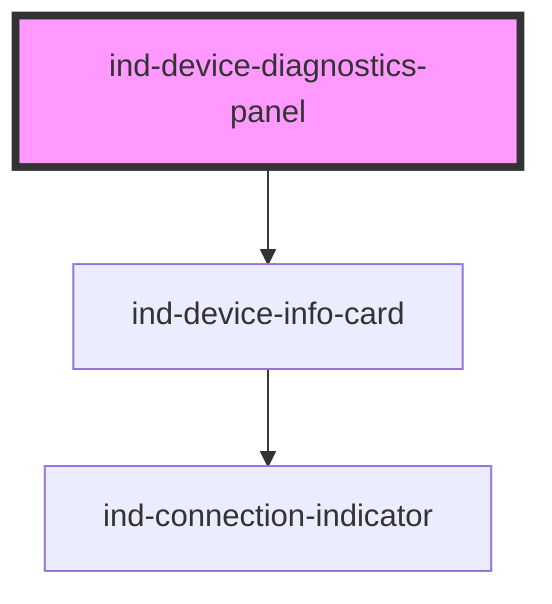

# ind-device-diagnostics-panel

<!-- Auto Generated Below -->

## Overview

Device diagnostics panel: nameplate / connection via `<ind-device-info-card>`
plus a list of live diagnostic metrics (CPU, memory, temperature, errors).

## Properties

| Property            | Attribute  | Description         | Type                                                       | Default          |
| ------------------- | ---------- | ------------------- | ---------------------------------------------------------- | ---------------- |
| `address`           | `address`  |                     | `string \| undefined`                                      | `undefined`      |
| `firmware`          | `firmware` |                     | `string \| undefined`                                      | `undefined`      |
| `heading`           | `heading`  |                     | `string`                                                   | `'Diagnostics'`  |
| `metrics`           | --         | Diagnostic metrics. | `DiagnosticMetric[]`                                       | `[]`             |
| `model`             | `model`    |                     | `string \| undefined`                                      | `undefined`      |
| `name` _(required)_ | `name`     |                     | `string`                                                   | `undefined`      |
| `serial`            | `serial`   |                     | `string \| undefined`                                      | `undefined`      |
| `state`             | `state`    |                     | `"connected" \| "connecting" \| "disconnected" \| "error"` | `'disconnected'` |
| `vendor`            | `vendor`   |                     | `string \| undefined`                                      | `undefined`      |

## Shadow Parts

| Part        | Description |
| ----------- | ----------- |
| `"heading"` |             |
| `"metric"`  |             |
| `"metrics"` |             |

## Dependencies

### Depends on

- [ind-device-info-card](../../molecules/device-info-card)

### Graph

----------------------------------------------

*Built with [StencilJS](https://stenciljs.com/)*
