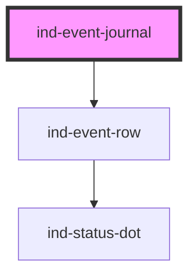

# ind-event-journal

<!-- Auto Generated Below -->

## Overview

Chronological event / system log built from `<ind-event-row>`s, with a
severity filter in the toolbar.

## Properties

| Property  | Attribute | Description                                      | Type                                                   | Default           |
| --------- | --------- | ------------------------------------------------ | ------------------------------------------------------ | ----------------- |
| `events`  | --        | Events, most-recent first.                       | `EventJournalItem[]`                                   | `[]`              |
| `filter`  | `filter`  | Active severity filter — `all` shows everything. | `"all" \| "error" \| "info" \| "success" \| "warning"` | `'all'`           |
| `heading` | `heading` |                                                  | `string`                                               | `'Event journal'` |

## Shadow Parts

| Part        | Description |
| ----------- | ----------- |
| `"filter"`  |             |
| `"heading"` |             |
| `"list"`    |             |

## Dependencies

### Depends on

- [ind-event-row](../../molecules/event-row)

### Graph

----------------------------------------------

*Built with [StencilJS](https://stenciljs.com/)*
