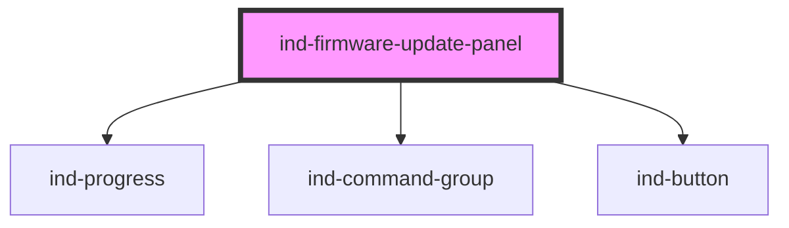

# ind-firmware-update-panel

<!-- Auto Generated Below -->

## Overview

Firmware update panel: current vs target version, update progress and the
Check / Install commands. Emits `indCheck` and `indInstall`.

## Properties

| Property                      | Attribute         | Description                                      | Type                                                                                              | Default      |
| ----------------------------- | ----------------- | ------------------------------------------------ | ------------------------------------------------------------------------------------------------- | ------------ |
| `currentVersion` _(required)_ | `current-version` | Installed version.                               | `string`                                                                                          | `undefined`  |
| `device`                      | `device`          | Device name.                                     | `string \| undefined`                                                                             | `undefined`  |
| `heading`                     | `heading`         |                                                  | `string`                                                                                          | `'Firmware'` |
| `progress`                    | `progress`        | Progress 0–100 % while downloading / installing. | `number`                                                                                          | `0`          |
| `state`                       | `state`           | Update state.                                    | `"available" \| "checking" \| "downloading" \| "error" \| "idle" \| "installing" \| "up-to-date"` | `'idle'`     |
| `targetVersion`               | `target-version`  | Available / target version.                      | `string \| undefined`                                                                             | `undefined`  |

## Events

| Event        | Description | Type                |
| ------------ | ----------- | ------------------- |
| `indCheck`   |             | `CustomEvent<void>` |
| `indInstall` |             | `CustomEvent<void>` |

## Shadow Parts

| Part         | Description |
| ------------ | ----------- |
| `"heading"`  |             |
| `"state"`    |             |
| `"versions"` |             |

## Dependencies

### Depends on

- [ind-progress](../../atoms/progress)
- [ind-command-group](../../molecules/command-group)
- [ind-button](../../atoms/button)

### Graph

----------------------------------------------

*Built with [StencilJS](https://stenciljs.com/)*
