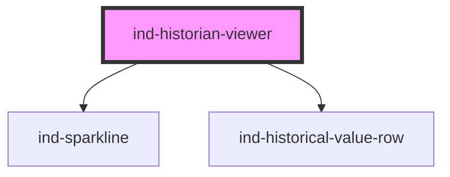

# ind-historian-viewer

<!-- Auto Generated Below -->

## Overview

Tabular history viewer for a single tag: header with tag/unit, an optional
sparkline overview, and a scrolling list of `<ind-historical-value-row>`s.

## Properties

| Property    | Attribute   | Description                  | Type                  | Default       |
| ----------- | ----------- | ---------------------------- | --------------------- | ------------- |
| `heading`   | `heading`   |                              | `string`              | `'Historian'` |
| `precision` | `precision` | Decimal places for the rows. | `number \| undefined` | `undefined`   |
| `samples`   | --          | Samples, most-recent first.  | `HistorianSample[]`   | `[]`          |
| `tag`       | `tag`       | Tag being viewed.            | `string \| undefined` | `undefined`   |
| `unit`      | `unit`      | Engineering unit.            | `string \| undefined` | `undefined`   |

## Shadow Parts

| Part         | Description |
| ------------ | ----------- |
| `"heading"`  |             |
| `"list"`     |             |
| `"overview"` |             |

## Dependencies

### Depends on

- [ind-sparkline](../../atoms/sparkline)
- [ind-historical-value-row](../../molecules/historical-value-row)

### Graph

----------------------------------------------

*Built with [StencilJS](https://stenciljs.com/)*
