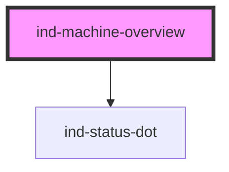

# ind-machine-overview

<!-- Auto Generated Below -->

## Overview

Machine overview header + content area. Shows machine identity and state in
the header; slot equipment / KPI molecules into the grid body.

## Properties

| Property               | Attribute    | Description                | Type                                                                           | Default     |
| ---------------------- | ------------ | -------------------------- | ------------------------------------------------------------------------------ | ----------- |
| `columns`              | `columns`    | Grid columns for the body. | `number`                                                                       | `3`         |
| `heading` _(required)_ | `heading`    |                            | `string`                                                                       | `undefined` |
| `machineId`            | `machine-id` | Machine identifier.        | `string \| undefined`                                                          | `undefined` |
| `oee`                  | `oee`        | OEE headline percentage.   | `number \| undefined`                                                          | `undefined` |
| `state`                | `state`      |                            | `"fault" \| "maintenance" \| "running" \| "stopped" \| "unknown" \| "warning"` | `'unknown'` |

## Shadow Parts

| Part        | Description |
| ----------- | ----------- |
| `"grid"`    |             |
| `"heading"` |             |
| `"oee"`     |             |
| `"state"`   |             |

## Dependencies

### Depends on

- [ind-status-dot](../../atoms/status-dot)

### Graph

----------------------------------------------

*Built with [StencilJS](https://stenciljs.com/)*
