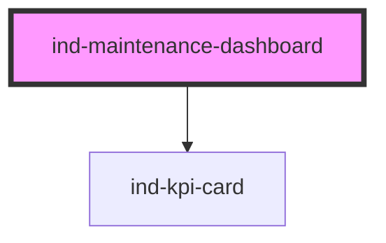

# ind-maintenance-dashboard

<!-- Auto Generated Below -->

## Overview

Maintenance KPIs (MTBF / MTTR / open & overdue work orders) plus an upcoming
/ overdue task list.

## Properties

| Property         | Attribute          | Description                         | Type                   | Default         |
| ---------------- | ------------------ | ----------------------------------- | ---------------------- | --------------- |
| `dueItems`       | --                 | Upcoming / overdue tasks.           | `MaintenanceDueItem[]` | `[]`            |
| `heading`        | `heading`          |                                     | `string`               | `'Maintenance'` |
| `mtbf`           | `mtbf`             | Mean time between failures (hours). | `number \| undefined`  | `undefined`     |
| `mttr`           | `mttr`             | Mean time to repair (hours).        | `number \| undefined`  | `undefined`     |
| `openWorkOrders` | `open-work-orders` | Open work orders.                   | `number`               | `0`             |
| `overdue`        | `overdue`          | Overdue work orders.                | `number`               | `0`             |

## Shadow Parts

| Part        | Description |
| ----------- | ----------- |
| `"asset"`   |             |
| `"due"`     |             |
| `"heading"` |             |
| `"kpis"`    |             |
| `"list"`    |             |
| `"row"`     |             |
| `"task"`    |             |

## Dependencies

### Depends on

- [ind-kpi-card](../../molecules/kpi-card)

### Graph

----------------------------------------------

*Built with [StencilJS](https://stenciljs.com/)*
