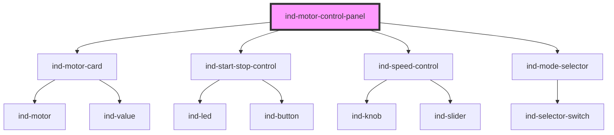

# ind-motor-control-panel

<!-- Auto Generated Below -->

## Overview

Motor control panel: live `<ind-motor-card>` faceplate plus start/stop,
speed setpoint and mode selection.

## Properties

| Property        | Attribute        | Description                           | Type                                                              | Default     |
| --------------- | ---------------- | ------------------------------------- | ----------------------------------------------------------------- | ----------- |
| `current`       | `current`        |                                       | `number \| undefined`                                             | `undefined` |
| `heading`       | `heading`        |                                       | `string`                                                          | `'Motor'`   |
| `load`          | `load`           |                                       | `number \| undefined`                                             | `undefined` |
| `mode`          | `mode`           |                                       | `string \| undefined`                                             | `undefined` |
| `speed`         | `speed`          |                                       | `number \| undefined`                                             | `undefined` |
| `speedSetpoint` | `speed-setpoint` | Speed setpoint (two-way), in percent. | `number`                                                          | `0`         |
| `state`         | `state`          |                                       | `"fault" \| "maintenance" \| "running" \| "stopped" \| "warning"` | `'stopped'` |
| `tag`           | `tag`            |                                       | `string \| undefined`                                             | `undefined` |

## Events

| Event      | Description | Type                  |
| ---------- | ----------- | --------------------- |
| `indMode`  |             | `CustomEvent<string>` |
| `indSpeed` |             | `CustomEvent<number>` |
| `indStart` |             | `CustomEvent<void>`   |
| `indStop`  |             | `CustomEvent<void>`   |

## Shadow Parts

| Part        | Description |
| ----------- | ----------- |
| `"heading"` |             |

## Dependencies

### Depends on

- [ind-motor-card](../../molecules/motor-card)
- [ind-start-stop-control](../../molecules/start-stop-control)
- [ind-speed-control](../../molecules/speed-control)
- [ind-mode-selector](../../molecules/mode-selector)

### Graph

----------------------------------------------

*Built with [StencilJS](https://stenciljs.com/)*
