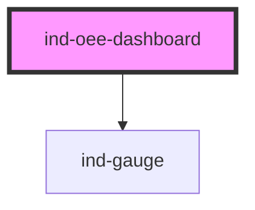

# ind-oee-dashboard

<!-- Auto Generated Below -->

## Overview

OEE dashboard: the headline OEE figure plus its three factors
(Availability × Performance × Quality) as radial gauges.

## Properties

| Property       | Attribute      | Description                        | Type                  | Default     |
| -------------- | -------------- | ---------------------------------- | --------------------- | ----------- |
| `availability` | `availability` | Availability % (0–100).            | `number`              | `0`         |
| `heading`      | `heading`      |                                    | `string`              | `'OEE'`     |
| `oee`          | `oee`          | Override the computed OEE (A×P×Q). | `number \| undefined` | `undefined` |
| `performance`  | `performance`  | Performance % (0–100).             | `number`              | `0`         |
| `quality`      | `quality`      | Quality % (0–100).                 | `number`              | `0`         |
| `subtitle`     | `subtitle`     | Context subtitle.                  | `string \| undefined` | `undefined` |

## Shadow Parts

| Part         | Description |
| ------------ | ----------- |
| `"gauges"`   |             |
| `"heading"`  |             |
| `"headline"` |             |

## Dependencies

### Depends on

- [ind-gauge](../../atoms/gauge)

### Graph

----------------------------------------------

*Built with [StencilJS](https://stenciljs.com/)*
