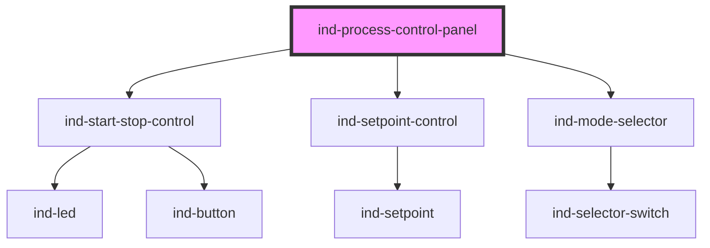

# ind-process-control-panel

<!-- Auto Generated Below -->

## Overview

Generic single-loop control panel: run command, setpoint vs PV and an
operating-mode selector. Re-emits the child commands so a parent can drive
the controller.

## Properties

| Property               | Attribute   | Description                | Type                                                            | Default     |
| ---------------------- | ----------- | -------------------------- | --------------------------------------------------------------- | ----------- |
| `heading` _(required)_ | `heading`   |                            | `string`                                                        | `undefined` |
| `max`                  | `max`       |                            | `number`                                                        | `100`       |
| `min`                  | `min`       |                            | `number`                                                        | `0`         |
| `mode`                 | `mode`      | Operating mode value.      | `string \| undefined`                                           | `undefined` |
| `precision`            | `precision` |                            | `number`                                                        | `1`         |
| `pv`                   | `pv`        | Process value.             | `number \| undefined`                                           | `undefined` |
| `setpoint`             | `setpoint`  | Setpoint (two-way).        | `number`                                                        | `0`         |
| `state`                | `state`     | Run state.                 | `"fault" \| "running" \| "starting" \| "stopped" \| "stopping"` | `'stopped'` |
| `step`                 | `step`      |                            | `number`                                                        | `0.1`       |
| `tag`                  | `tag`       | Loop tag (e.g. "PIC-101"). | `string \| undefined`                                           | `undefined` |
| `unit`                 | `unit`      |                            | `string \| undefined`                                           | `undefined` |

## Events

| Event         | Description                        | Type                  |
| ------------- | ---------------------------------- | --------------------- |
| `indMode`     | Fires with the selected mode.      | `CustomEvent<string>` |
| `indSetpoint` | Fires with the committed setpoint. | `CustomEvent<number>` |
| `indStart`    |                                    | `CustomEvent<void>`   |
| `indStop`     |                                    | `CustomEvent<void>`   |

## Shadow Parts

| Part        | Description |
| ----------- | ----------- |
| `"heading"` |             |

## Dependencies

### Depends on

- [ind-start-stop-control](../../molecules/start-stop-control)
- [ind-setpoint-control](../../molecules/setpoint-control)
- [ind-mode-selector](../../molecules/mode-selector)

### Graph

----------------------------------------------

*Built with [StencilJS](https://stenciljs.com/)*
