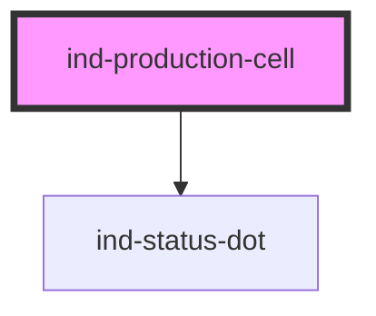

# ind-production-cell

<!-- Auto Generated Below -->

## Overview

Production cell container: groups the machines / equipment of a work cell
under a single header with an aggregate state. Slot the machine overviews or
equipment cards into the body.

## Properties

| Property               | Attribute | Description                | Type                                                                           | Default     |
| ---------------------- | --------- | -------------------------- | ------------------------------------------------------------------------------ | ----------- |
| `cellId`               | `cell-id` | Cell identifier.           | `string \| undefined`                                                          | `undefined` |
| `columns`              | `columns` | Grid columns for the body. | `number`                                                                       | `2`         |
| `heading` _(required)_ | `heading` |                            | `string`                                                                       | `undefined` |
| `state`                | `state`   | Aggregate cell state.      | `"fault" \| "maintenance" \| "running" \| "stopped" \| "unknown" \| "warning"` | `'unknown'` |

## Shadow Parts

| Part        | Description |
| ----------- | ----------- |
| `"grid"`    |             |
| `"heading"` |             |

## Dependencies

### Depends on

- [ind-status-dot](../../atoms/status-dot)

### Graph

----------------------------------------------

*Built with [StencilJS](https://stenciljs.com/)*
