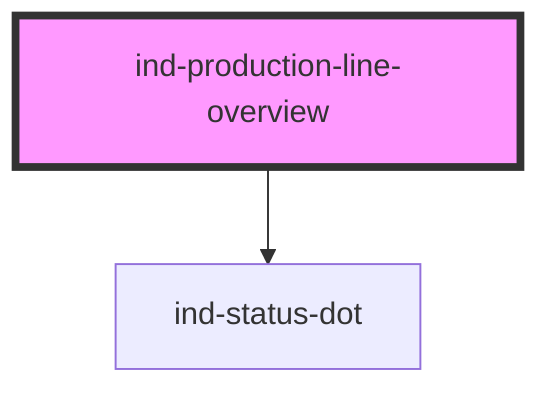

# ind-production-line-overview

<!-- Auto Generated Below -->

## Overview

Left-to-right production line overview: a sequence of station status tiles
connected by flow arrows. Each tile shows state, tag and an optional rate.

## Properties

| Property   | Attribute | Description | Type            | Default             |
| ---------- | --------- | ----------- | --------------- | ------------------- |
| `heading`  | `heading` |             | `string`        | `'Production line'` |
| `stations` | --        |             | `LineStation[]` | `[]`                |

## Shadow Parts

| Part        | Description |
| ----------- | ----------- |
| `"arrow"`   |             |
| `"heading"` |             |
| `"line"`    |             |
| `"station"` |             |

## Dependencies

### Depends on

- [ind-status-dot](../../atoms/status-dot)

### Graph

----------------------------------------------

*Built with [StencilJS](https://stenciljs.com/)*
