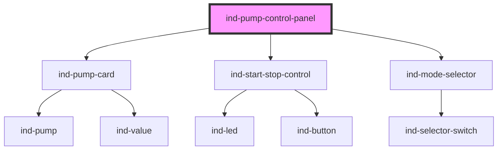

# ind-pump-control-panel

<!-- Auto Generated Below -->

## Overview

Pump control panel: `<ind-pump-card>` faceplate plus start/stop and mode.

## Properties

| Property   | Attribute  | Description | Type                                                              | Default     |
| ---------- | ---------- | ----------- | ----------------------------------------------------------------- | ----------- |
| `flow`     | `flow`     |             | `number \| undefined`                                             | `undefined` |
| `heading`  | `heading`  |             | `string`                                                          | `'Pump'`    |
| `mode`     | `mode`     |             | `string \| undefined`                                             | `undefined` |
| `pressure` | `pressure` |             | `number \| undefined`                                             | `undefined` |
| `state`    | `state`    |             | `"fault" \| "maintenance" \| "running" \| "stopped" \| "warning"` | `'stopped'` |
| `tag`      | `tag`      |             | `string \| undefined`                                             | `undefined` |

## Events

| Event      | Description | Type                  |
| ---------- | ----------- | --------------------- |
| `indMode`  |             | `CustomEvent<string>` |
| `indStart` |             | `CustomEvent<void>`   |
| `indStop`  |             | `CustomEvent<void>`   |

## Shadow Parts

| Part        | Description |
| ----------- | ----------- |
| `"heading"` |             |

## Dependencies

### Depends on

- [ind-pump-card](../../molecules/pump-card)
- [ind-start-stop-control](../../molecules/start-stop-control)
- [ind-mode-selector](../../molecules/mode-selector)

### Graph

----------------------------------------------

*Built with [StencilJS](https://stenciljs.com/)*
