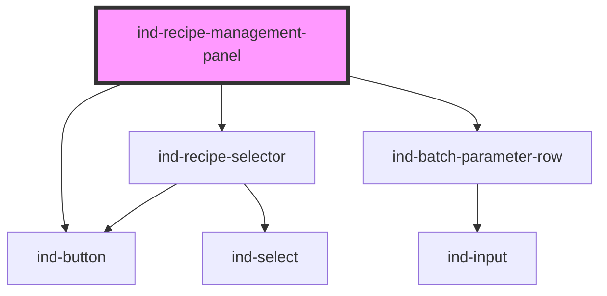

# ind-recipe-management-panel

<!-- Auto Generated Below -->

## Overview

Recipe management panel: pick / load a recipe, review its parameter set and
save edits. Combines `<ind-recipe-selector>` with a parameter list.

## Properties

| Property     | Attribute  | Description                        | Type                  | Default               |
| ------------ | ---------- | ---------------------------------- | --------------------- | --------------------- |
| `editable`   | `editable` | Allow editing the parameters.      | `boolean`             | `false`               |
| `heading`    | `heading`  |                                    | `string`              | `'Recipe management'` |
| `parameters` | --         | Parameters of the selected recipe. | `BatchParam[]`        | `[]`                  |
| `recipes`    | --         | Available recipes.                 | `SelectOption[]`      | `[]`                  |
| `value`      | `value`    | Selected recipe (two-way).         | `string \| undefined` | `undefined`           |

## Events

| Event       | Description | Type                  |
| ----------- | ----------- | --------------------- |
| `indChange` |             | `CustomEvent<string>` |
| `indLoad`   |             | `CustomEvent<string>` |
| `indSave`   |             | `CustomEvent<void>`   |

## Shadow Parts

| Part        | Description |
| ----------- | ----------- |
| `"heading"` |             |
| `"params"`  |             |

## Dependencies

### Depends on

- [ind-button](../../atoms/button)
- [ind-recipe-selector](../../molecules/recipe-selector)
- [ind-batch-parameter-row](../../molecules/batch-parameter-row)

### Graph

----------------------------------------------

*Built with [StencilJS](https://stenciljs.com/)*
