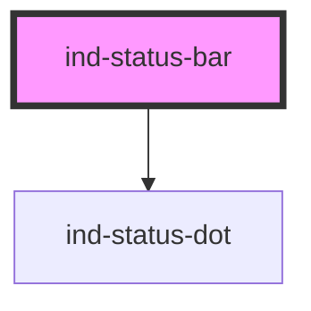

# ind-status-bar

<!-- Auto Generated Below -->

## Overview

Global footer bar: status dot + message on the left, slotted content on the right.

Sized to be unobtrusive (~24 px). Drop additional `` / `<ind-button size="sm">`
children for right-aligned context (timestamps, server identifiers, action buttons).

## Properties

| Property  | Attribute | Description | Type                                                                                                             | Default     |
| --------- | --------- | ----------- | ---------------------------------------------------------------------------------------------------------------- | ----------- |
| `message` | `message` |             | `string \| undefined`                                                                                            | `undefined` |
| `state`   | `state`   |             | `"error" \| "fault" \| "info" \| "maintenance" \| "neutral" \| "running" \| "stopped" \| "success" \| "warning"` | `'neutral'` |

## Shadow Parts

| Part        | Description |
| ----------- | ----------- |
| `"end"`     |             |
| `"message"` |             |

## Dependencies

### Depends on

- [ind-status-dot](../../atoms/status-dot)

### Graph

----------------------------------------------

*Built with [StencilJS](https://stenciljs.com/)*
