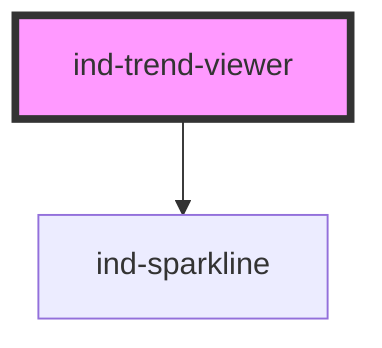

# ind-trend-viewer

<!-- Auto Generated Below -->

## Overview

Multi-series trend viewer. Stacks one labelled `<ind-sparkline>` per series
with the current value, for comparing several tags without a full charting
library.

## Properties

| Property  | Attribute | Description     | Type            | Default    |
| --------- | --------- | --------------- | --------------- | ---------- |
| `heading` | `heading` |                 | `string`        | `'Trends'` |
| `series`  | --        | Series to plot. | `TrendSeries[]` | `[]`       |

## Shadow Parts

| Part        | Description |
| ----------- | ----------- |
| `"heading"` |             |
| `"series"`  |             |

## Dependencies

### Depends on

- [ind-sparkline](../../atoms/sparkline)

### Graph

----------------------------------------------

*Built with [StencilJS](https://stenciljs.com/)*
