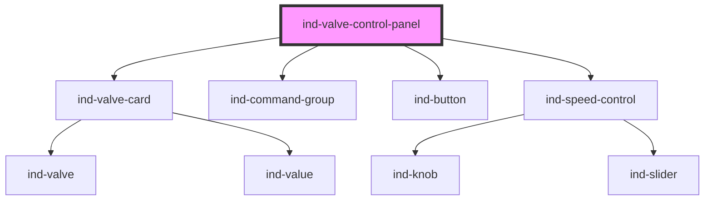

# ind-valve-control-panel

<!-- Auto Generated Below -->

## Overview

Valve control panel: `<ind-valve-card>` faceplate plus Open / Close / Stop
commands and an optional position setpoint for modulating valves.

## Properties

| Property           | Attribute           | Description                                       | Type                                         | Default     |
| ------------------ | ------------------- | ------------------------------------------------- | -------------------------------------------- | ----------- |
| `heading`          | `heading`           |                                                   | `string`                                     | `'Valve'`   |
| `modulating`       | `modulating`        | Allow position control (modulating valve).        | `boolean`                                    | `false`     |
| `position`         | `position`          | Current position 0–100 %. Omit for on/off valves. | `number \| undefined`                        | `undefined` |
| `positionSetpoint` | `position-setpoint` | Position setpoint (two-way).                      | `number`                                     | `0`         |
| `state`            | `state`             |                                                   | `"closed" \| "fault" \| "open" \| "transit"` | `'closed'`  |
| `tag`              | `tag`               |                                                   | `string \| undefined`                        | `undefined` |

## Events

| Event         | Description | Type                  |
| ------------- | ----------- | --------------------- |
| `indClose`    |             | `CustomEvent<void>`   |
| `indOpen`     |             | `CustomEvent<void>`   |
| `indPosition` |             | `CustomEvent<number>` |
| `indStop`     |             | `CustomEvent<void>`   |

## Shadow Parts

| Part        | Description |
| ----------- | ----------- |
| `"heading"` |             |

## Dependencies

### Depends on

- [ind-valve-card](../../molecules/valve-card)
- [ind-command-group](../../molecules/command-group)
- [ind-button](../../atoms/button)
- [ind-speed-control](../../molecules/speed-control)

### Graph

----------------------------------------------

*Built with [StencilJS](https://stenciljs.com/)*
