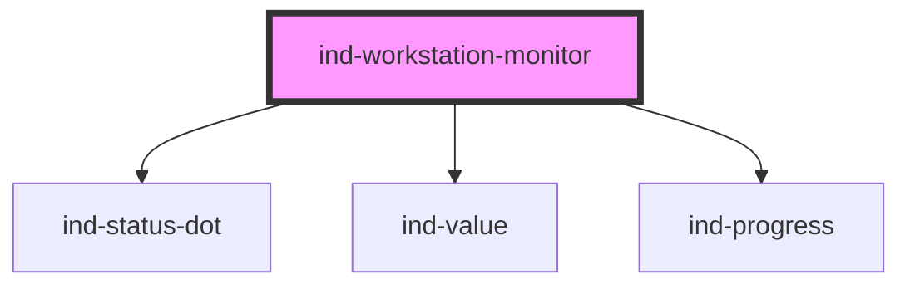

# ind-workstation-monitor

<!-- Auto Generated Below -->

## Overview

Operator workstation monitor: station + operator, current job, produced /
rejected counts and progress to target.

## Properties

| Property   | Attribute  | Description               | Type                                                                           | Default         |
| ---------- | ---------- | ------------------------- | ------------------------------------------------------------------------------ | --------------- |
| `heading`  | `heading`  |                           | `string`                                                                       | `'Workstation'` |
| `job`      | `job`      | Current job / order.      | `string \| undefined`                                                          | `undefined`     |
| `operator` | `operator` | Operator name.            | `string \| undefined`                                                          | `undefined`     |
| `produced` | `produced` | Produced count.           | `number`                                                                       | `0`             |
| `rejected` | `rejected` | Rejected count.           | `number`                                                                       | `0`             |
| `state`    | `state`    |                           | `"fault" \| "maintenance" \| "running" \| "stopped" \| "unknown" \| "warning"` | `'unknown'`     |
| `station`  | `station`  | Station identifier.       | `string \| undefined`                                                          | `undefined`     |
| `target`   | `target`   | Target count for the job. | `number \| undefined`                                                          | `undefined`     |

## Shadow Parts

| Part        | Description |
| ----------- | ----------- |
| `"figures"` |             |
| `"heading"` |             |
| `"job"`     |             |

## Dependencies

### Depends on

- [ind-status-dot](../../atoms/status-dot)
- [ind-value](../../atoms/value)
- [ind-progress](../../atoms/progress)

### Graph

----------------------------------------------

*Built with [StencilJS](https://stenciljs.com/)*
